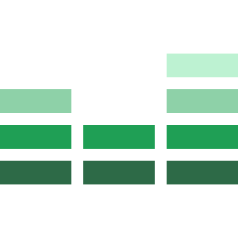

Mantis Equalizr
===============

> A small set of useful rules to complement resets and normalizers

[](http://badge.fury.io/js/mantis-equalizr)

<p align="center">
  
</p>

---


Installation
------------

The installation can be done in 3 steps:

- **Step 1**

	Install via NPM:

	```sh
	$ npm i --save mantis-equalizr
	```

- **Step 2**

	You can use this plugin in different ways, but all consist of passing the plugin to the [`.use`](http://stylus-lang.com/docs/js.html#usefn) method of Stylus.
	For this example, I'll use it with [Gulp](http://gulpjs.com/) in a ES6 enviornment.

	```javascript
	import gulp from 'gulp';
	import stylus from 'gulp-stylus';
	import equalizr from 'mantis-equalizr';

	gulp.task('css', () =>
		gulp.src('path-to-source.styl')
			.pipe(stylus({
				use: [
					equalizr()
				]
			}))
			.pipe(gulp.dest('path-to-dest/'))
	);
	```

- **Step 3**

	Now just import the plugin into your `.styl` file as you already know.

	```styl
	@import 'mantis-equalizr'
	```


License
-------

© 2016 [Acauã Montiel](http://acauamontiel.com.br)

[MIT License](http://acaua.mit-license.org/)
